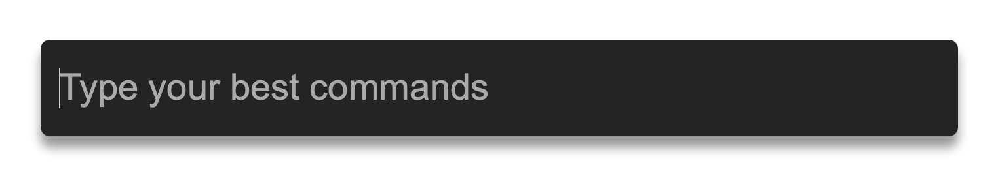

# @actus

This repo holds a command palette with robust interactions and predictable behavior backed by a finite state machine.
A command palette (or command bar) is a user interface that receives user input and presents the user with a list of matching commands and executes the command the user chooses.

You see this kind of UI in many application nowadays. `Ctrl/cmd + k` in Slack and Discord, `Ctrl/cmd + p` in VS Code, `cmd + Space` in MacOS etc.

> I wanted to have as much as possible handled in a UI framework / library agnostic way, so gluing it to a React or Svelte component should be trivial.

## Self learning

It's self learning in the sense that it ranks items higher the more you pick them for a certain input. To follow trends and have new commands
have achance to get to the top fairly quick, it doesn't keep the execution history forever but normalizes it from time to time. See [packages/core/src/exec-graph.ts](packages/core/src/exec-graph.ts) for the implementation of this.

## Demo

Here's a demo of the Svelte implementation of the core: [https://ti99l.csb.app](https://ti99l.csb.app)

## States and transitions

**Open / Close**

The command palette behaves as most palettes do. It's able to become visible by using a hot-key, and closed with the escape key.

**Command matching and ranking**

While open and on user input, it waits for relevant commands and rank the matching ones in a natural order (the ranking algo can be overridden) with the best match on top.

**Command list selection**

With the matching command results listed, the top one is selected automatically (called auto selection). If the user would continue typing, the top one should always stay selected until the user selects one manually (with arrow keys or hover with the mouse).

If the user selects one manually (called id selection), and then continues typing, as long as the selected command is in the list it should stay selected, no matter if its position changes. When the selected result isn't available in the result list anymore (due to not matching anymore), the top result should be selected again (by position, not by id).

The user is able to step over the selection boundaries (pressing arrow down on the last result should roll over to select the top result and vice versa).

**Dynamic list of commands**

Commands might be added and removed at any time, and the palette should be able to handle that when opened. If a new command becomes available and it matches the current user input, it should be shown in the correct position in the result listing and should not interfere with any user selection.

**Execution**

The user can execute a command in two ways: Click on it or press Enter.
When a command is executed, the palette should close and the user input should be emptied.

**Remember non executed input**

If the user types something in the command palette input but closes it without executing, the palette should remember it and populate the input once the user opens it again.

## The Finite State Machine

Have a look at [packages/core/src/selection-machine.ts](packages/core/src/selection-machine.ts) to see the machine and its services / actions / guards implementations.

Here's a visualization of the machine:

