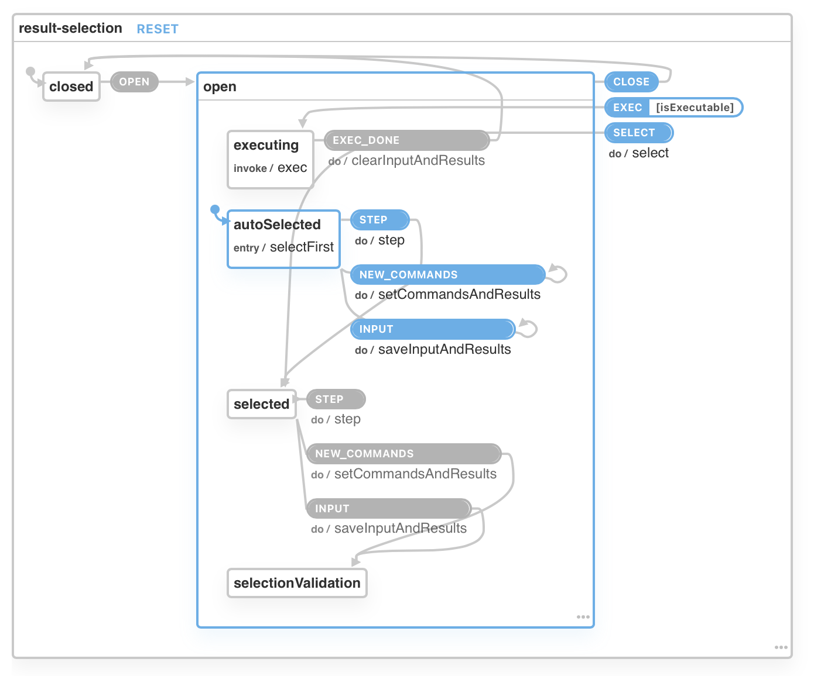

# @actus/core

This is the machine and inner core of the Actus command bar.

It consists of a Finite State Machine, an input parser, and a result ranking algorithm.

## Usage

```bash
npm install @actus/core
```

See the Svelte example in `packages/` for more detailed info.

```ts
import { interpret, filterAndSort, selectionMachine } from "@actus/core";

const selectionService = interpret(selectionMachine);
const commands = [
    {
        id: "1",
        title: "My command",
        description: "My description",
        exec: () => {
            console.log("Executed!");
        },
    },
];
selectionService.send("NEW_COMMANDS", commands);

// Bind it to the UI of choice and send events
// when the user inputs something or clicks on a result
selectionService.send("INPUT", "m");
selectionService.send("EXEC", "1");
```

## The Finite State Machine

Have a look at [src/selection-machine.ts](src/selection-machine.ts) to see the machine and its services / actions / guards implementations.

Here's a visaulization of the machine:


## Commands

Type definition of a command:

```typescript
type Command = {
    id: string;
    title: CommandTitle;
    description: CommandDescription;
    exec: ExecutionFn;
    getMatchString?: GenerateMatchStringFn;
    requiredArgs?: string[];
};
type CommandTitle = string | CommandTitleFn;
type CommandTitleFn = (input: ParserResult) => string;
type CommandDescription = string | CommandDescriptionFn;
type CommandDescriptionFn = (input: ParserResult) => string;
type ExecutionFn = (command: Command, input: ParserResult) => void;
type GenerateMatchStringFn = (input: ParserResult) => string;
type ParserResult = [string] | [string, ParserParams] | null;
type ParserParams = {
    [key: string]: string;
};
```

## The parser

The parser is built using [Nearley](http://nearley.js.org).

Check out [src/grammar/parse-input.ne](src/grammar/parse-input.ne) for the grammar.

Here's what the parse outputs:

```ts
type ParserResult = [string] | [string, ParserParams] | null;
type ParserParams = {
    [key: string]: string;
};
```

Examples:

```
hello                    -> ["hello"]
hello -p                 -> ["hello", {p: null}]
hello -p 1               -> ["hello", {p: "1"}]
hello -p 1 -r "hello x"  -> ["hello", {p: "1", r: "hello x"}]
hello -p "               -> null (broken string)
```
